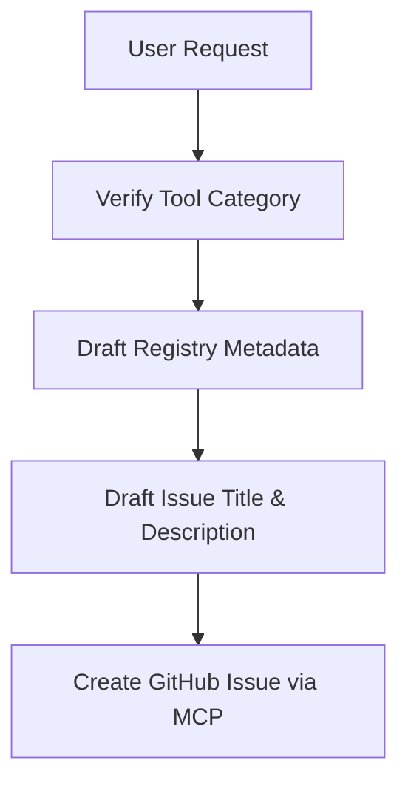

# Skill: Project Planning & Issue Scoping

*   **Skill ID**: WS-SKILL-001
*   **Target Scope**: Scoping features, new tools, and creating issues.
*   **Mandatory Rule Reference**: [docs/requirements.md](../../docs/requirements.md), [git-workflow.md](../rules/git-workflow.md)

---

## 1. Purpose

To guide the AI agent through the sequence of analyzing a user request for a new tool, mapping it to existing categories, and creating structured issues using GitHub MCP.

---

## 2. Inputs

*   A user request detailing a new tool or feature.
*   The current [docs/requirements.md](../../docs/requirements.md) file.
*   The existing [src/config/tools-registry.ts](../../src/config/tools-registry.ts) registry file.

---

## 3. Workflow

1.  **Categorization Check**: Analyze the tool against the six core categories defined in `requirements.md`. If it does not fit, flag it to the developer.
2.  **Metadata Draft**: Generate the proposed metadata schema:
    *   `id`: Slug (lowercase, hyphenated).
    *   `name`: Plain English.
    *   `description`: Under 160 characters.
    *   `tags`: 3-5 search aliases.
3.  **Issue Definition**: Draft a structured GitHub Issue including:
    *   A description of the tool.
    *   Detailed functional checklist.
    *   Required third-party dependencies (if any).
    *   Acceptance criteria (Performance targets, Core Web Vitals compliance).
4.  **GitHub Push**: Use the GitHub MCP tool to create the issue under the repository and link it to the developer project board.

---

## 4. Expected Output

*   A structured GitHub Issue created via MCP.
*   The issue number returned to the user with links to the planning task lists.

---

## 5. Completion Checklist

- [ ] Has the tool category been matched to one of the six core groups?
- [ ] Is the proposed metadata slug unique and under 160 characters?
- [ ] Has the GitHub Issue been created with clear acceptance criteria?
- [ ] Is the issue assigned to a tracking milestone in GitHub Projects?
